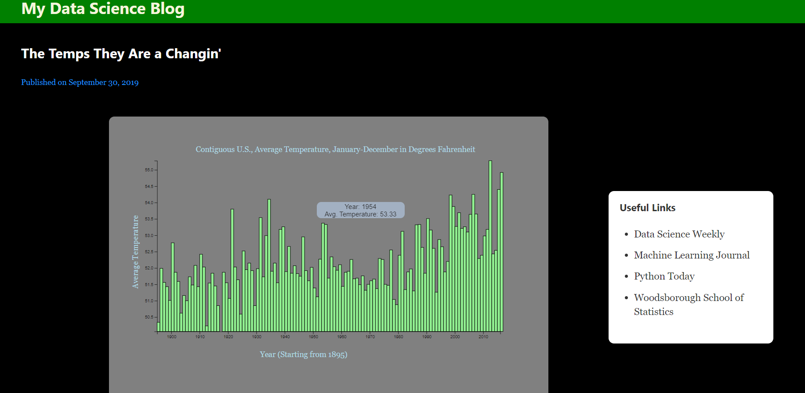

# v11-solo-willjw3
Chingu Voyage 11
## Simple Bar Chart
*A React component library that lets you easily insert bar charts into your web app just by passing in a handful of parameters*

 

**Installation**
```
npm install @willjw3/simple-bar-chart
```

**Example Usage**
There are four chart components available for use:
- `BarChart` is the most basic component. It displays a simple bar chart with n bars, spaced apart by a user-chosen interval.
- `BarChartNeg` also displays a simple bar chart with n bars spaced apart evenly, but negative values are also allowed.
- `BarChartLinear` displays a simple bar chart with bars displayed across a continuous interval.
- `BarChartLinearNeg` displays a simple bar chart with bars displayed across a continuous interval, and allows negative values.

1. Import the desired component
```
import { BarChartLinear } from "@willjw3/simple-bar-chart"
```

2. Pass setting parameters as props
```
<BarChartLinear
    horizontal={years} 
    vertical={temps}
    margin={{
        top: 90,
        bottom: 60,
        right: 60,
        left: 60
    }}
    width={800}
    height={400}
    barColor={`lightgreen`}
    barBorder={`black`}
    spaceBetween={.1}
    horizontalText={{text: "Year (Starting from 1895)", color: "lightblue", space: 20, fromLeft: 300}}
    verticalText={{text: "Average Temperature", color: "lightblue", space: 15, fromTop: -350}}
    setMin={[false, 0]}
    title={{text: globaldata.description.title + " in " + globaldata.description.units, color: "lightblue", fromLeft: 150}}
    canvas={{width: "800px", height: "550px", background: "gray", border: {style: "solid", width: "1px", color: "transparent", radius: "10px"}}}
    chartBackground={"gray"}
    tooltip={{x: "Year", y: "Avg. Temperature", background: "lightsteelblue", color: "black", opacity: "0.7", width: "160px", height: "30px", xshift: 18, yshift: 44}}
/>
```

In the above example, 
- `years` and `temps` would be arrays created from data brought into the app from an external api. 
- The `horizontal` and `vertical` props take in arrays with an equal number of elements. It's up to you to get the data into these arrays. 
- `horizontalText` is for the x-axis label and `verticalText` is for the y-axis label.
- `setMin` is for setting whether the minimum value on the y-axis corresponds to the value of the minimum data point or a value which the user chooses. To use the value corresponding to the minimum data point value, use `setMin={[false, 0]}`. To use a custom value, use `setMin={[true: <your custom value>]}` 
- `width` and `height` are for the chart background, while `canvas` is the `div` that wraps the chart. 
- In this example, `title.text` takes values from a `json` object that contains the data used. 
- `tooltip` handles the element displayed when hovering over a bar. 
