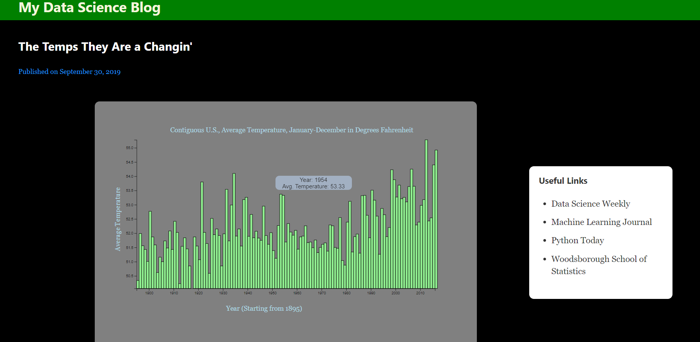

# v11-solo-willjw3
Chingu Voyage 11
## Simple Bar Chart
*A React component library that lets you easily insert bar charts into your web app just by passing in a handful of parameters*

 

**Installation**
```
npm install @willjw3/simple-bar-chart
```

**Example Usage**
There are four chart components available for use:
- `BarChart` is the most basic component. It displays a simple bar chart with n bars, spaced apart by a user-chosen interval.
- `BarChartNeg` also displays a simple bar chart with n bars spaced apart evenly, but negative values are also allowed.
- `BarChartLinear` displays a simple bar chart with bars displayed across a continuous interval.
- `BarChartLinearNeg` displays a simple bar chart with bars displayed across a continuous interval, and allows negative values.

1. Import the desired component
```
import { BarChartLinear } from "@willjw3/simple-bar-chart"
```

2. Pass setting parameters as props
```
<BarChartLinear
    horizontal={years} 
    vertical={temps}
    margin={{
        top: 90,
        bottom: 60,
        right: 60,
        left: 60
    }}
    width={800}
    height={400}
    barColor={`lightgreen`}
    barBorder={`black`}
    spaceBetween={.1}
    horizontalText={{text: "Year (Starting from 1895)", color: "lightblue", space: 20, fromLeft: 300}}
    verticalText={{text: "Average Temperature", color: "lightblue", space: 15, fromTop: -350}}
    setMin={[false, 0]}
    title={{text: globaldata.description.title + " in " + globaldata.description.units, color: "lightblue", fromLeft: 150}}
    chartBackground={"gray"}
    tooltip={{x: "Year", y: "Avg. Temperature", background: "lightsteelblue", color: "black", opacity: "0.7", width: "160px", height: "30px", xshift: 18, yshift: 44}}
/>
```

3. Wrap chart components in a `div` for controlling size, placement, etc... Widths and heights aren't automatically adjusted based on screen size, so you'll have to use this `div` for resizing.

**Passed props in the above example:**
- `horizontal` - array of values defining the horizontal displacement from the y-axis of each bar.
- `vertical` - array of values defining the height of each bar with its base on the x-axis. In this example, `years` and `temps` would be arrays created from data brought into the app from an external api. It's up to you to get the data into these arrays.
- `margin` - space between the edge of the canvas (chart background) and the content of the chart, including labels.
- `width` and `height` are for the chart canvas.
- `barColor` - color of bars in the chart.
- `barBorder` - outline color of bars. Set to 'transparent' for no outline.
- `spaceBetween` - sets the amount of space between bars for `barChart` and `barChartNeg` charts. Ranges from 0 to 1 with 0 being no space and 1 being the maximum space. 
- `horizontalText` is for the x-axis label and 
- `verticalText` is for the y-axis label. The `space` property affects the movement of the text in a direction perpendicular to its associated axis. `fromLeft` moves the text horizontally (parallel to the x-axis) and `fromTop` moves the text vertically (parallel to the y-axis)
- `setMin` -  for setting whether the minimum value on the y-axis corresponds to the value of the minimum data point or a value which the user chooses. To use the value corresponding to the minimum data point value, use `setMin={[false, 0]}`. To use a custom value, use `setMin={[true: <your custom value>]}` 
- `title` - the title of your chart. In this example, `title.text` takes values from a `json` object that contains the data used.
- `chartBackground` is the color of the chart's background. 
- `tooltip` - displays data corresponding to a given bar when hovering over it. `x` is the horizontal axis label, `y` is the vertical axis label, `xshift` and `yshift` control the distance of the tooltip display from its corresponding bar in the horizontal and vertical directions, respectively.

**Contribute**
- to address any problems with the library, or to suggest any improvements, follow [this link](https://github.com/chingu-voyages/v11-solo-willjw3/issues) and post an issue.
- to fix any code issues or fix/improve the documentation here, submit your changes in the form of a pull request by following [this link](https://github.com/chingu-voyages/v11-solo-willjw3/pulls).

**Author:** @willjw3
